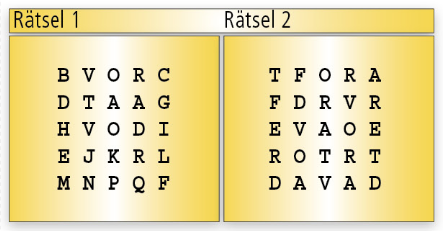

# bwinf40 | A3: Wortsuche

In Rätselheften gibt es oft Rechtecke mit lauter Buchstaben, in welchen man vorgegebene Wörter finden muss.
Diese sind vorwärts oder rückwärts geschrieben in den Zeilen, Spalten und Diagonalen versteckt.

Hier sind zwei Beispiele. Zu finden sind die Wörter `VOR`, `RAD`, `EVA`, `TORF`.

Viele Menschen würden das zweite Rätsel intuitiv als schwieriger bezeichnen.
Ein Grund ist, dass es viele Fragmente der gesuchten Wörter enthält, während im ersten Rätsel die Wörter sehr hervorstechen.

Es gibt aber auch noch eine Menge weiterer Kriterien, die so ein Rätsel für Menschen leichter oder schwerer erscheinen lassen.

## Aufgabe 3

Überlege dir verschiedene solche Kriterien und definiere mit deren Hilfe mindestens drei verschiedene Schwierigkeitsgrade.

Schreibe ein Programm, das eine gegebene Wortliste und die Größe des Rechtecks einliest und daraus Buchstabenrechtecke
entsprechend deiner Schwierigkeitsgrade erzeugt.

Wende dein Programm mindestens auf alle Beispiele an, die du im Ordner [/beispieldaten](/beispieldaten) findest, und dokumentiere die Ergebnisse.
  
